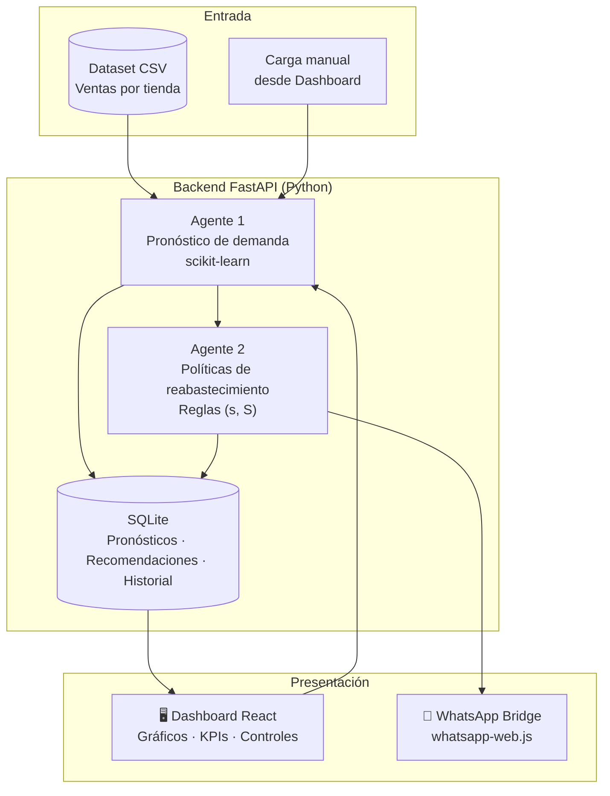

## Arquitectura



### Flujo

```
Dataset → Agente 1 (Pronóstico) → Agente 2 (Reabastecimiento) → Dashboard / WhatsApp
```

1. **Dataset**: ventas históricas (`fecha`, `tienda`, `producto`, `cantidad`, etc.).
2. **Agente 1**: limpia datos, agrega demanda diaria por producto, entrena modelos y pronostica 14 días.
3. **Agente 2**: lee pronósticos, aplica política de punto de reorden y genera cantidades sugeridas.
4. **Dashboard**: visualiza todo y permite ejecutar agentes manualmente.
5. **WhatsApp**: el Agente 2 calcula los datos (cantidades, prioridades, fechas) y Gemini los redacta en lenguaje natural para el tendero; si Gemini no está disponible, el sistema cae a un conjunto de respuestas basadas en reglas por palabras clave.


## Tecnologías y justificación

| Tecnología | Uso | ¿Por qué? |
|------------|-----|-----------|
| **Python 3.10+** | Lenguaje principal | Estándar en ML/IA, fácil de enseñar |
| **FastAPI** | API REST | Rápido, moderno, documentación automática (`/docs`) |
| **Pandas** | Limpieza y agregación de datos | Ideal para CSV y transformaciones |
| **scikit-learn** | Pronóstico (Regresión Lineal) | Gratuito, interpretable, sin GPU |
| **SQLite** | Persistencia | Cero configuración, archivo local |
| **React + Vite** | Dashboard | UI moderna, responsive, componentes reutilizables |
| **Recharts** | Gráficos | Open source, integración simple con React |
| **whatsapp-web.js** | WhatsApp | 100% gratuito vía WhatsApp Web (QR) |
| **Node.js** | Bridge WhatsApp | Necesario para la librería de WhatsApp Web |
| **Gemini API (Flash-Lite)** | Redacción conversacional del bot de WhatsApp | Gratuito, interpreta y comunica resultados ya calculados por el Agente 2 — no hace cálculos numéricos propios |


## Estructura del proyecto

```
EEP/
├── backend/
│   └── app/
│       ├── main.py              # Entrada FastAPI
│       ├── config.py            # Variables y rutas
│       ├── database.py          # SQLite (historial, pronósticos)
│       ├── agents/
│       │   ├── forecast_agent.py       # Agente 1
│       │   └── replenishment_agent.py  # Agente 2 + WhatsApp NLP
│       ├── services/
│       │   └── data_service.py  # Carga y limpieza CSV
│       └── api/
│           └── routes.py        # Endpoints REST
├── dashboard/                   # Frontend React
│   ├── src/App.jsx
│   └── package.json
├── whatsapp/                    # Bridge WhatsApp gratuito
│   └── bot.js
├── data/                        # Dataset activo y BD (generado)
├── models/                      # Modelos entrenados (.joblib)
├── requirements.txt
├── .env.example
├── iniciar.bat                  # Script de inicio rápido (Windows)
└── README.md
```

### Instalar dependencias Python

```bash
py -m ensurepip --upgrade
py -m pip install -r requirements.txt
```

### Configurar variables de entorno

```bash
copy .env.example .env
```

Editar `.env` para cambiar parámetros de reabastecimiento:

| Variable | Descripción | Default |
|----------|-------------|---------|
| `API_PORT` | Puerto del backend | `8000` |
| `FORECAST_HORIZON_DAYS` | Días a pronosticar | `14` |
| `LEAD_TIME_DAYS` | Tiempo de entrega (días) | `7` |
| `SAFETY_FACTOR` | Factor de stock de seguridad | `1.5` |
| `GEMINI_API_KEY` | Key de Google AI Studio para redacción con IA | (vacío = usa reglas) |
| `GEMINI_MODEL` | Modelo de Gemini a usar | `gemini-2.5-flash-lite` |

### Instalar dependencias del Dashboard

```bash
cd dashboard
npm install
cd ..
```

### Instalar bridge WhatsApp

```bash
cd whatsapp
npm install
cd ..
```


## Ejecución

### Opción 1

iniciar.bat


### Opción 2 

**Terminal 1 — Backend:**

```bash
cd backend
py -m uvicorn app.main:app --host 0.0.0.0 --port 8000 --reload
```

**Terminal 2 — Dashboard:**

```bash
cd dashboard
npm run dev
```

**Terminal 3 — WhatsApp (opcional):**

```bash
cd whatsapp
npm start
```

## Paso a paso

### (Agente 1)


**「Ejecutar pronóstico」**
El Agente 1:
   - Carga `data/ventas.csv` (copiado automáticamente del dataset académico)
   - Limpia fechas y cantidades
   - Entrena un modelo por producto
   - Guarda pronósticos en SQLite

vía API:


curl -X POST http://localhost:8000/api/agents/forecast/run


### (Agente 2)

**「Generar sugerencias」**
El Agente 2 calcula punto de reorden, stock de seguridad y cantidades

```bash
curl -X POST http://localhost:8000/api/agents/replenishment/run
```

### Cargar nuevos datasets

**「Cargar dataset CSV」**
debe tener las columnas: `fecha`, `tienda`, `categoria de producto`, `vendedor`, `producto`, `cantidad`, `precio`, `total`
Vuelve a ejecutar el Agente 1

---

## Funcionamiento detallado

### Agente 1

**Entrada:** CSV de ventas por 

**Proceso:**
1. Parseo flexible de fechas (formatos mixtos `01/02/2026` y `1/13/2026`)
2. Agregación: suma diaria de `cantidad` por `producto`
3. Por cada producto se entrena `LinearRegression` con features:
   - Días desde inicio de serie
   - Día de la semana (0-6)
   - Mes (1-12)
4. Productos con poca historia usan **media móvil de 7 días**
5. Pronóstico a 14 días hacia el futuro

**Salida:** registros en tabla `forecasts` + modelo en `models/forecast_models.joblib`

### Agente 2

**Entrada:** último pronóstico del Agente 1

**Política simplificada (punto de reorden):**

```
demanda_media_diaria = promedio del pronóstico
stock_seguridad      = demanda_media × FACTOR_SEGURIDAD × √LEAD_TIME
punto_reorden        = demanda_media × LEAD_TIME + stock_seguridad
cantidad_sugerida    = pronóstico_periodo + stock_seguridad - stock_simulado
```

**Prioridades:**
- **Alta**: cantidad ≥ 1.5× demanda del periodo de revisión
- **Media**: cantidad moderada
- **Baja**: cantidad baja

**Salida:** tabla `recommendations` con producto, cantidad, fecha sugerida y justificación.

### Comunicación entre agentes

Los agentes **no se llaman directamente**. Se comunican vía **SQLite**:
- Agente 1 escribe en `forecasts`
- Agente 2 lee el último `execution_id` de pronósticos

Esto permite re-ejecutar cada agente de forma independiente.


## Configuración del modelo de IA

Parámetros en `.env`:

```env
FORECAST_HORIZON_DAYS=14   # Horizonte de pronóstico
MIN_HISTORY_DAYS=14        # Mínimo de días para usar regresión
LEAD_TIME_DAYS=7           # Días de entrega del proveedor
SAFETY_FACTOR=1.5          # Multiplicador de stock de seguridad
REVIEW_PERIOD_DAYS=7       # Periodo de revisión de inventario
```

---

## API principal

| Método | Endpoint | Descripción |
|--------|----------|-------------|
| GET | `/api/health` | Estado del servicio |
| GET | `/api/status` | Estado de agentes |
| GET | `/api/kpis` | Indicadores consolidados |
| POST | `/api/agents/forecast/run` | Ejecutar Agente 1 |
| POST | `/api/agents/replenishment/run` | Ejecutar Agente 2 |
| POST | `/api/dataset/upload` | Subir CSV |
| GET | `/api/charts/demand` | Datos para gráficos |
| GET | `/api/recommendations/latest` | Últimas recomendaciones |
| POST | `/api/whatsapp/query` | Consulta al bot (redactada por Gemini, con fallback a reglas) |

Documentación interactiva: **http://localhost:8000/docs**

---

## Mantenimiento

- **Resetear base de datos:** eliminar `data/sistema.db`
- **Resetear modelos:** eliminar `models/forecast_models.joblib`
- **Resetear WhatsApp:** eliminar carpeta `whatsapp/.wwebjs_auth/`

---

## Limitaciones conocidas

- El dataset de ejemplo actual (`Dataset/extracted/Productos_vendidos_portienda .csv`) es un dataset genérico de retail/electrodomésticos, no de víveres y abarrotes — pendiente de reemplazar por datos representativos del caso de uso real.
- El archivo CSV de ejemplo tiene problemas de codificación de caracteres en el origen (tildes y ñ se muestran corruptos); no es un bug del código de carga (que ya intenta UTF-8, Latin-1 y CP1252), sino del propio archivo — requiere re-exportar el dataset en UTF-8 limpio.
- El bridge de WhatsApp (`whatsapp-web.js`) requiere una sesión activa en un equipo local, vinculada por código QR — no es un servicio desplegado en la nube. Si la máquina se apaga o pierde conexión, el bot deja de responder.

---